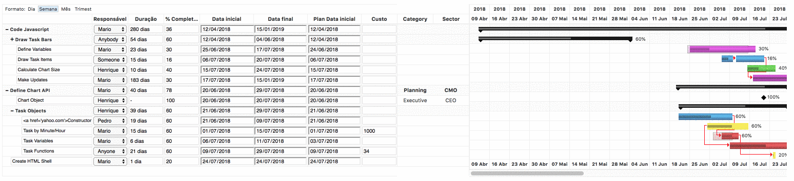

# ng-gantt — Angular Gantt Editor

[](https://github.com/jsGanttImproved/ng-gantt/actions/workflows/ci.yml)
[](https://www.npmjs.com/package/ng-gantt)
[](./LICENSE)

Angular wrapper for [jsgantt-improved](https://github.com/jsGanttImproved/jsgantt-improved). View and edit Gantt charts in your Angular application.

**[Live Demo (GitHub Pages)](https://jsganttimproved.github.io/ng-gantt/)** &nbsp;|&nbsp; **[StackBlitz](https://stackblitz.com/edit/angular-ng-gantt)**



## Installation

```bash
npm install --save jsgantt-improved ng-gantt
```

## Usage

### 1. Import the module

```ts
import { NgGanttEditorModule } from 'ng-gantt';

@NgModule({
  imports: [
    NgGanttEditorModule
  ]
})
export class AppModule { }
```

### 2. Set up your component

```ts
import { Component, ViewChild } from '@angular/core';
import { GanttEditorComponent, GanttEditorOptions } from 'ng-gantt';

@Component({
  selector: 'app-root',
  template: '<ng-gantt [options]="editorOptions" [data]="data"></ng-gantt>',
  styleUrls: ['./app.component.css']
})
export class AppComponent {
  public editorOptions: GanttEditorOptions;
  public data: any;

  @ViewChild(GanttEditorComponent, { static: true }) editor: GanttEditorComponent;

  constructor() {
    this.editorOptions = new GanttEditorOptions();
    this.data = [
      {
        pID: 1,
        pName: 'Define Chart API',
        pStart: '',
        pEnd: '',
        pClass: 'ggroupblack',
        pLink: '',
        pMile: 0,
        pRes: 'Brian',
        pComp: 0,
        pGroup: 1,
        pParent: 0,
        pOpen: 1,
        pDepend: '',
        pCaption: '',
        pNotes: 'Some Notes text'
      }
    ];
  }
}
```

## Inputs

| Input | Type | Default | Description |
|-------|------|---------|-------------|
| `options` | `GanttEditorOptions` | `new GanttEditorOptions()` | jsgantt-improved configuration options passed directly to `setOptions()`. |
| `format` | `string` | `'week'` | Initial time-scale format. One of `'hour'`, `'day'`, `'week'`, `'month'`, `'quarter'`. |
| `data` | `Object[]` | — | Task rows. Each object is passed to `AddTaskItemObject()`. Setting this input after init destroys and redraws the chart. |
| `redrawOnResize` | `boolean` | `true` | When `true`, the chart is redrawn whenever the window is resized (including browser zoom changes). Set to `false` to manage redraws yourself. |

### 3. Add styles

In your `src/styles.css`:

```css
@import "~jsgantt-improved/dist/jsgantt.css";
```

## Development

```bash
# Install dependencies
npm install

# Build the library
npm run build:lib

# Build and serve the demo app
npm run reload
```

## Docs / GitHub Pages

The `docs/` directory contains a standalone HTML demo served via GitHub Pages at
[https://jsganttimproved.github.io/ng-gantt/](https://jsganttimproved.github.io/ng-gantt/).

On every push to `master` the CI pipeline also builds the Angular demo app and
deploys it to the `gh-pages` branch automatically.

## CI / CD

GitHub Actions handles:

| Trigger | Jobs |
|---|---|
| Push / PR to `master` | Install → build library → build app |
| Push to `master` | + Deploy Angular app to GitHub Pages (`gh-pages` branch) |

See [`.github/workflows/ci.yml`](.github/workflows/ci.yml).

## License

[MIT](./LICENSE)
